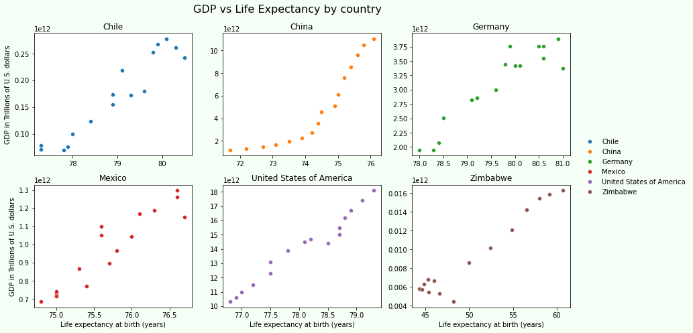

# Life Expectancy and GDP

In this project, we analyze data on GDP and life expectancy from the World Health Organization and the World Bank to try and identify the relationship between the GDP and life expectancy of six countries.

During this project, we analyze, prepare, and plot data in order to answer questions in a meaningful way.

After performing the analysis, we'll be creating a blog post to share our findings on the World Health Organization website.

You can check more information about this project in [Data Scientist Career Path](https://www.codecademy.com/learn/paths/data-science-2021) from Codecademy.

## Example Graphs found in this project

## Objectives and Prerequisites

Project Objectives:
* Complete a project to add to your portfolio
* Use seaborn and Matplotlib to create visualizations
* Become familiar with presenting and sharing data visualizations
* Preprocess, explore, and analyze data

Prerequisites:
* Data Acquisition
* Data Visualization
* Hypothesis Testing
* Summarizing Quantitative Data
* Data Wrangling and Tidying
* Data Manipulation with Pandas

## Created by
[Didash20](https://github.com/didash20)